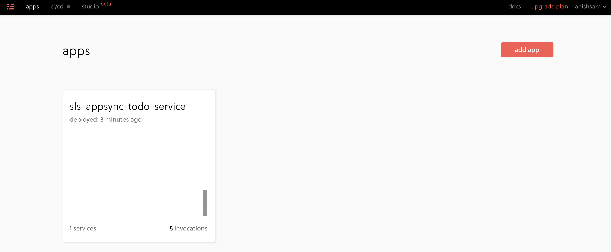
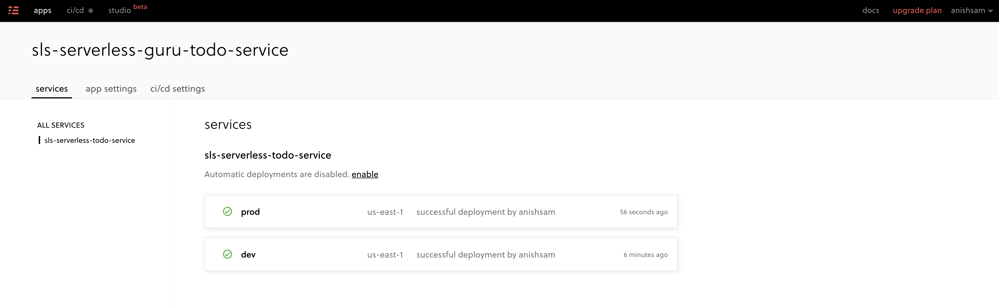

# AWS AppSync API with Lambda and DynamoDB

AWS AppSync API which uses lambda and DynamoDB resolvers built using the Serverless Framework and also utilizing serverless framework pro for AWS IAM role deployments

## Deployment

To deploy the service, following command can be used:

```
sls deploy --stage dev
```

Note that the stage variables allows to have multiple instances of the solution deployed for various development stages.

## Sample Queries

The sample queries that can be executed from AppSync are available in queries.txt file.

## Screenshots

### Serverless Pro Apps Screen



### Serverless Pro App Details Screen


