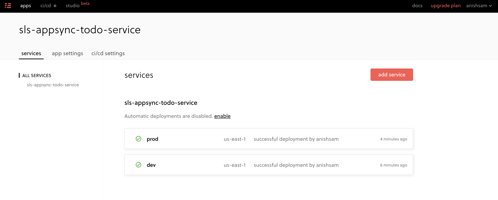

# AWS AppSync API with Lambda and DynamoDB

This project uses AWS AppSync API with lambda and DynamoDB resolvers, and is built using the Serverless Framework. This also utilizes serverless framework pro for management and monitoring of the service.

## Architecture

Following is the high level architecture of this solution:


## Deployment

To deploy the service, following command can be used:

```
sls deploy --stage dev
```

Note that the stage variables allows to have multiple instances of the solution deployed for various development stages.

## Sample Queries

The sample queries that can be executed from AppSync are available in [queries.txt](queries.txt) file.

## Screenshots

### Serverless Pro Apps Screen


### Serverless Pro App Services Screen



### Serverless Pro App Overview Screen


### AppSync Apps on AWS Console


### AppSync Queries on AWS Console


